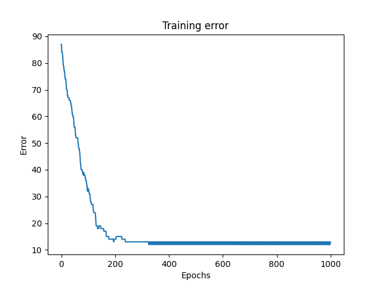
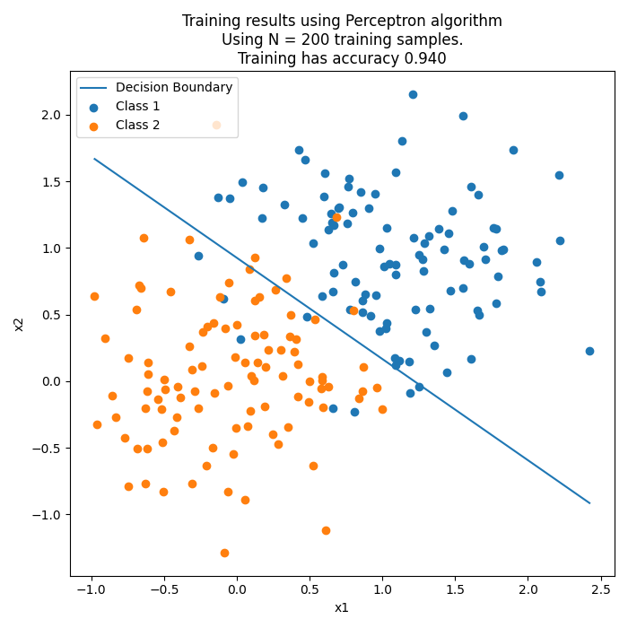

# Exercises

*Author: Christian Salomonsen*

## Table of contents
***
1. [Results and images](#results)
2. [How to use](#how-to-use)
***
## Results
##### From week 38 multilayer perceptron / Neural network

Bonus:

##### From week 36 perceptron algorithm

***
## How to use

This repository contains two local libraries used in most weekly sets denoted `week{xx}`. The libraries are one `LinearClassifiers` and `networks` which respectively contain some classic linear classifiers as a Perceptron, sum of errors squared and Least mean squared algorithms. The networks library contain a neural network using the multilayer perceptron approach (planning to implement a radial basis function network as well).

1. Open repository in your local prompt.
2. It is recommended to use a virtual enviroment of some sort.
3. Use `> pip install -r requirements.txt`.
