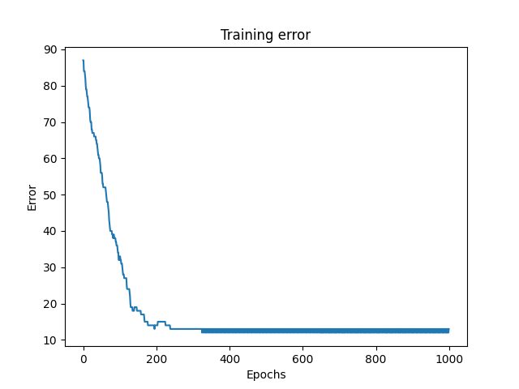
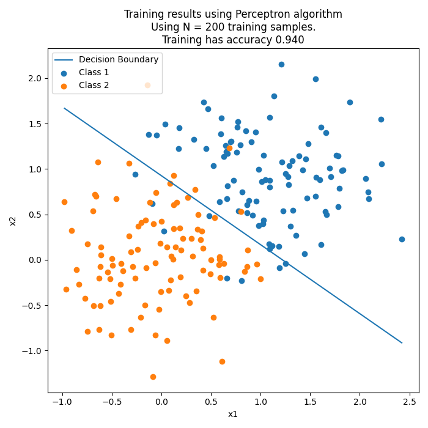
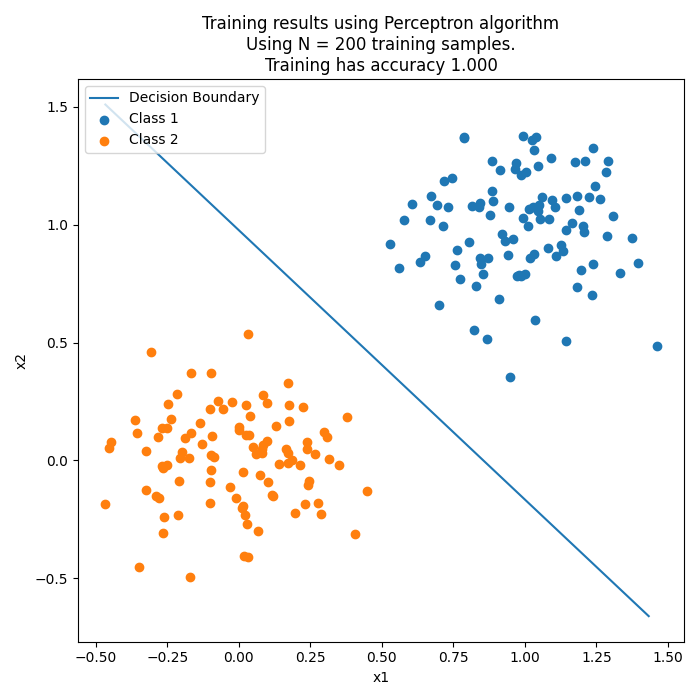
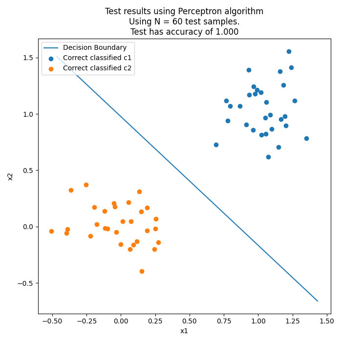
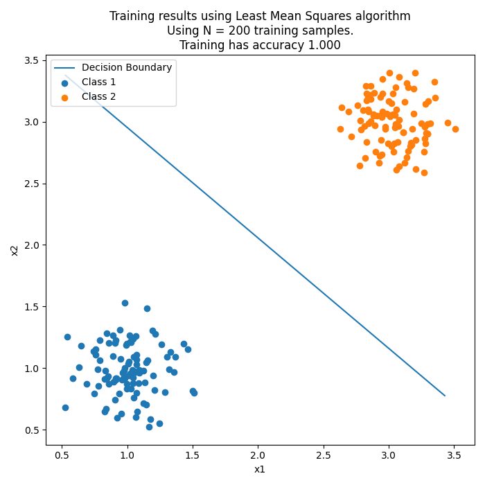
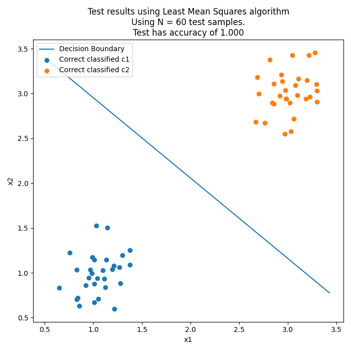
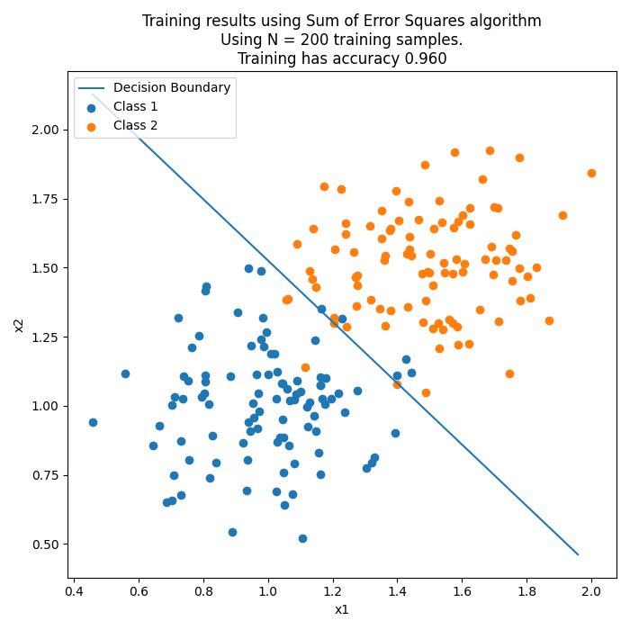
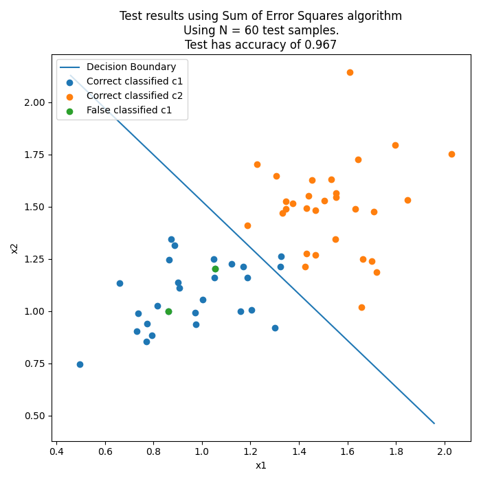

# Week 36

*Author: Christian Salomonsen*

## Results

#### Perceptron

##### 1. After tweaking learning rate, inseparable classes

##### 2. Before tweaking learning rate, but separable classes

#### Least mean squares

#### Sum of error squared

