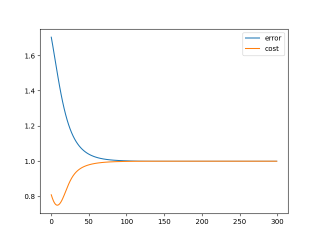

# Ukesoppgaver uke 38

*Author: Christian Salomonsen*

### Oppgave 4.2 status:

###### 1. Fungerer ikke som den skal, ser ut til at `error` ligger et sted mellom 1.8 og konvergerer mot 1. Vil jo anta at denne ideelt sett skal konvergere mot null.
###### 2. `cost` ser ut til å være flippet, siden vi bruker MSE og denne øker og skal konvergere mot null antar jeg at det bare er klasse-lablene som er flippet.

