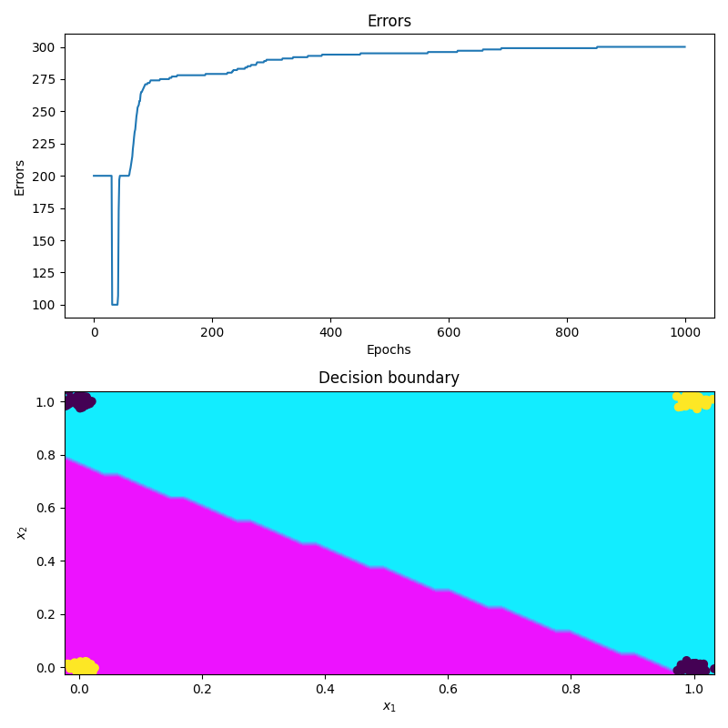
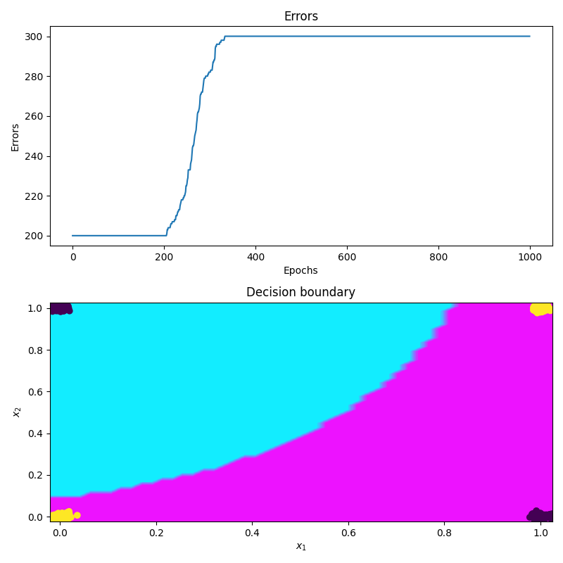

# Ukesoppgaver uke 38

*Author: Christian Salomonsen*

### Oppdatering!
Har en større bug som ser ut til å maksimere feilen, men her er resultatet fra dette.

Endelig en decision boundary som er ikke-lineær.

