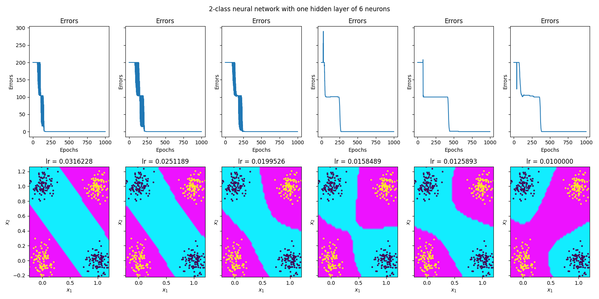

# Ukesoppgaver uke 38

*Author: Christian Salomonsen*

### solution to problem 4.2

Ser fortsatt at feilen øker for en learning rate på 0.0125893. Oppgaven tok ca. 2 uker fra start til slutt...

#### Tester samme oppgave med 6 neurons i hidden layer.

Ser mye bedre ut